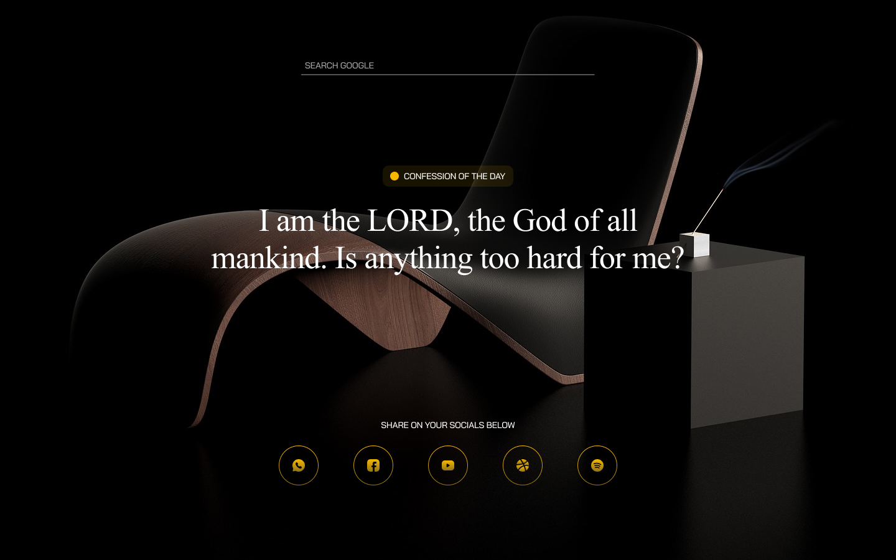

# HolyTab 🎖️

Transform every new tab into a moment of spiritual reflection

## Built By 👨

1. Adedoyin Emmanuel Adeniyi (Fullstack Engineer) <https://adedoyinemmanuel.dev>
2. Frames 56 (Product Designer) <https://frame.panthone.design>

## ✨ Overview

Holy Tab is a Chrome extension that transforms your new tab experience into a spiritual journey. Each time you open a new tab, you'll be greeted with a fresh, Bible-centered confession to inspire your faith and keep you rooted in God's word throughout your day.


## 🚀 Features

- **Daily Confessions**: Fresh, Bible-centered confessions on every new tab
- **Beautiful Interface**: Clean and distraction-free design
- **Spiritual Growth**: Stay connected to your faith while browsing
- **Lightweight**: Fast-loading and resource-efficient
- **Offline Support**: Access confessions even without internet connection
- **Free & Open Source**: It is free and open source.
- **Social Sharing**: Share your confessions with folks on various social platforms.



## 🔧 Installation

1. Visit the [Chrome Web Store](https://chrome.google.com/webstore)
2. Search for "Holy Tab" or click the direct link
3. Click "Add to Chrome"
4. Open a new tab to start experiencing Holy Tab

## 💡 How to Use

1. Simply open a new tab in Chrome
2. Read and meditate on the displayed confession
3. Refresh the page for a new confession (optional)
4. Click on the logo to visit our website

## 🛠️ Development

To set up the development environment:

```bash
# Clone the repository
git clone https://github.com/adedoyin-emmanuel/holytab.git

# Navigate to project directory
cd holytab

# Navigate to scrapper, web or extension directory

cd web


# Install dependencies
npm install

# Start development server
npm run dev
```
