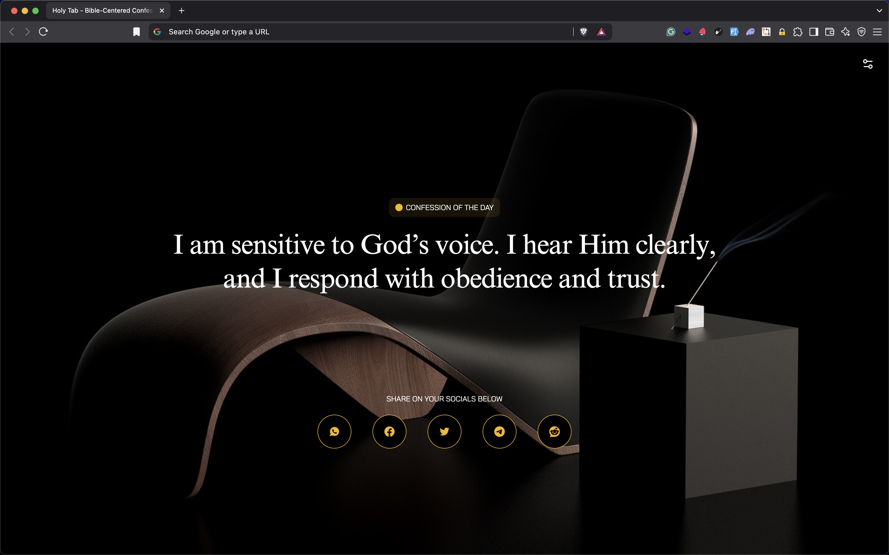

# HolyTab 🎖️

Transform every new tab into a moment of spiritual reflection <https://holytab.adedoyin.dev>

[Download HolyTab from Chrome webstore](https://chromewebstore.google.com/detail/holytab/iflnngdlafnhjjebkiocghjpkaplebpd)

## ✨ What's New

**Latest Updates:**

- **Seamless Updates**: You will be notified to check for updates every 3 weeks. Also, you get all 2.6k confessions after installing the extension (all local) no internet connection required!


## Why Did I Build This ❓ / How I built this 🤔

The spirit of God has laid it upon my heart last year (2023) to build a confession app. Then, I was in KTI (Kingsword Training Institute) Level 1. I didn't pay much attention to till last month (October 2024). Holy Spirit told me again and this time I was like yeah, I've to build this. I did some research to know if someone has built something like this before but to my surprise, I found none. Most bible related extensions were just typical bible verses chrome extensions and there wasn't a site where I could get a lot of confessions from. So I started building mine. I got confessions from Kingsword Chicago website. <https://chicago.kingsword.org>. And then I did some editing and then I had about 1,000 confessions. I got more confessions from my Deacon in church, then from my local church installation <https://kingswordalagbado.org>. After compling everthing, I had about 2k confessions to start with. I built an API out of it and then contacted Frames. Frames is a cool guy I met at Osca Fest (Tech event) last year. To my surprise he agreed to work on the project with me. I was so surprised because everytime I tried reaching out to a UI designer to work on a projct together, it is either I get aired or most times they are busy with other projects which I totally understand. He started working and then bingo Frames was done. Then I started cooking, and then before I knew it, I was done. I deployed the web version, tested it and sent it to my friends. I then packaged the extension to submit on chrome store. To my surprise, creating a developer account on Chrome costs $5. I was shocked. I had some funds on me but spending $5 on something I built for free and didn't monetize wasn't something I expected. But then, this zeal that woudln't allow me end this project just because of $5. I eventually paid the funds and published the extension to chrome store.

## Built By 👨

1. Adedoyin Emmanuel Adeniyi (Fullstack Engineer) <https://adedoyinemmanuel.dev>
2. Frames 56 (Product Designer) <https://frame.panthone.design>

## ✨ Overview

Holy Tab is a Chrome extension that transforms your new tab experience into a spiritual journey. Each time you open a new tab, you'll be greeted with a fresh, Bible-centered confession to inspire your faith and keep you rooted in God's word throughout your day.


## 🚀 Features

- **Daily Confessions**: Fresh, Bible-centered confessions on every new tab
- **Beautiful Interface**: Clean and distraction-free design
- **Customizable Experience**: Personalize your experience with various settings
- **Auto-Refresh**: Set confessions to automatically refresh at your preferred intervals
- **Seamless Updates**: Easily update the extension without reinstallation
- **Spiritual Growth**: Stay connected to your faith while browsing
- **Lightweight**: Fast-loading and resource-efficient
- **Offline Support**: Access confessions even without internet connection
- **Free & Open Source**: It is free and open source
- **Social Sharing**: Share your confessions with folks on various social platforms
- **Web Version**: We also have a web version you can try even without installing the chrome extension <https://holytab.adedoyin.dev>


## 🔧 Installation

[Download HolyTab from Chrome webstore](https://chromewebstore.google.com/detail/holytab/iflnngdlafnhjjebkiocghjpkaplebpd)

1. Visit the [Chrome Web Store](https://chrome.google.com/webstore)
2. Search for "Holy Tab" or click the direct link
3. Click "Add to Chrome"
4. Open a new tab to start experiencing Holy Tab

## 💡 How to Use

1. Simply open a new tab in Chrome
2. Read and meditate on the displayed confession
3. Click the settings icon to customize your experience:
   - Enable auto-refresh functionality
   - Set your preferred refresh interval
   - Check for updates directly within the extension
4. Share confessions with your friends and family on various social platforms
5. Visit <https://documenter.getpostman.com/view/25154969/2sAYBREtgn> to integrate Holytabs API in your app




## 🔄 Staying Updated

HolyTab now features a seamless update mechanism:

1. Click on the menu tab in the extension
2. Select "Check for Update" in the modal
3. Install any available updates without needing to reinstall the entire extension

## 🛠️ Development

To set up the development environment:

```bash
# Clone the repository
git clone https://github.com/adedoyin-emmanuel/holytab.git

# Navigate to project directory
cd holytab

# Navigate to scrapper, web or extension directory

cd web


# Install dependencies
npm install

# Start development server
npm run dev
```

## Special Thanks 🙌

1. Frames 56: Thank you soo much for working on this project with me. I can't thank you enough.
2. Kingsword International Ministeries (DR Kay Ijisesan): If you are wondering where most of the confessions came from, well they are from Kingsword specifically from DR Kayode Ijisesan. These confessions aren't just specific to a church, they are confessions every believer can meditate on. You may or may not see this but thank you.

## Contributions

You're free to make contributions to this project, just create an issue, wait for me to assign the issue to and then create a new branch to work on it then submit a PR.

Also if you love the confessions and you're wondering where you can access them, You can get the confessions in the scapper directory. If you need an API for that. You can try ours at <https://holytabs.adedoyin.dev/api/confession>. Please don't use this for your production app. It is runnning on a free vercel instance for now and it is rate limited.

If you still have any questions. Just reach out to me via <hi@adedoyinemmanuel.dev>
